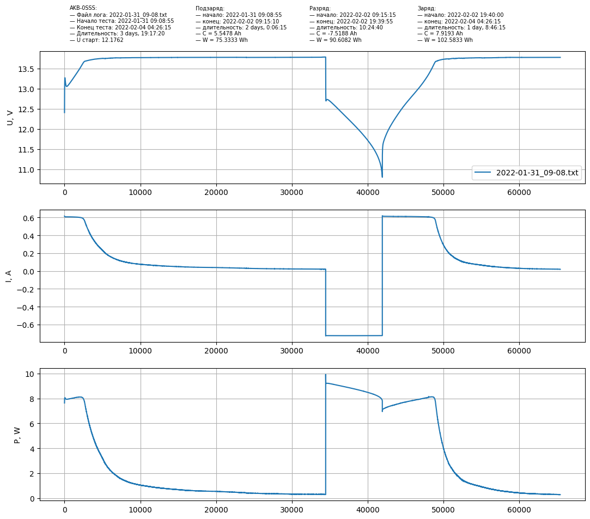

# Battery charge graph
## Анализ логов тестирования батарей ИБП и представление их в графическом виде.

На графиках представлена динамика напряжения, силы тока и мощности на батарее во время тестирования. Вместо времени на оси абсцисс выбран интервал [0; N], где N — количество, например, напряжений в логе.

Обрабатываются все файлы *.txt в текущей директории:

- если файл один, то откроется окно просмотра графика и сохранится картинка PNG;
- если два, то их графики будут накладываться друг на друга и сохранится картинка PNG;
Накладывание графиков сделано для наглядного представления двух логов одной батареи, сделанных в разное время. При этом, накладывание графиков может происходить в двух режимах:

    1) без смещения второго графика;
    2) со смещением.
Это сделано из-за возможного разного времени подзарядки батареи. Смещение включается переменной **OFFSET**. Так же нужно учесть, что для корректного наложения необходимо в начале имени файла, в котором записей больше, добавить 1, в котором меньше — 2. Чтобы смещался график той батареи, у которой время подзарядки было меньше.

- если более двух, то изображения графиков сохранятся в виде отдельных PNG без окна просмотра.

Так же на графиках отображается дополнительная информация из лога:

1) Время начала\конца тестирования, подзарядки, разрядки и зарядки. Длительность каждого этапа.
2) Стартовое напряжение.
3) Общая ёмкость и общая мощность каждого из этапов тестирования.

Пример отдельного графика:

Пример наложенных графиков без смещения:

Пример наложенных графиков со смещением:

